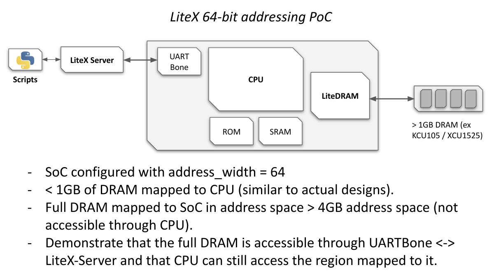

[> Intro
--------

This project aims to demonstrate 64-bit addressing in LiteX. The following PoC design is created to
demonstrate a first use-case of 64-bit addressing: Being able to MMAP a full 2GB DRAM to a LiteX SoC:



[> Run Tests/Simulations.
-------------------------

- `wishbone64bitsSRAMAccess.py`: *wishbone* only test
- `axi64bitsSRAMAccess.py`: to test *AXILite* to *AXILite* or *wishbone* to *AXILite*

Data are 32bits width and bus is configured with 64bits address width.

In both case:

- two generators produces a stream to fill two *SRAM*:
  1. the first has an base address >32bits
  2. the second has an base adresse < 32bits
- when generators finishes two checkers reads SRAM content and compare values with the pattern writen by generators.

**Usage:**

```bash
python3 -m wishbone64bitsSRAMAccess [--trace]
```
or
```bash
python3 -m axi64bitsSRAMAccess [--trace] [--endpoint-bus-std BUS_STANDARD]
```

with `BUS_STANDARD`:
- *wishbone*
- *axi-lite* (default)

`--trace` is used to write an `vcd` file with signals dump (*build/sim/gateware/sim.vcd*)

[> Build/Run it on Arty (256MB of RAM).
---------------------------------------

**Usage:**

```bash
python -m digilent_arty --build --load [--sram-test] [--sdram-test]
```

- `sram-test` is a small test with two SRAM: one located at `0x0_0002_0000`,
  second at `0x4_0002_0000`
- `sdram-test` add a new `SoCRegion` at `0x4_0000_0000` connected to a second
  SDRAM port.

*Note*: for both test `--bus-standard=axi-lite` may be used to replace
*wishbone* by an *axi-lite* bus.

*Note*: `litex_server` must be run after load:
```
litex_server --uart --addr-width=64 --uart-port=/dev/ttyUSB1
```

## SRAM Test

Both have the same base `0x20000` but second is displaced by `0x400000000`
(*2^34*), so if MSB are dropped all write/read with be applied in the first SRAM
Region.

** Usage **

```
./test_SRAMAccess.py [--sram] [--access]
```

- `--sram` fills first SRAM with one sequence and second with another sequence
  and read back both regions to check if no collision.
- `--access` is similar but instead of writting a linear sequence, patterns are
  written at a random address.

## SDRAM Test

This test add a second `SoCRegion` connected to a second SDRAM's port. This
allows to validate SDRAM access with high address (SDRAM is mirrored in both
*SoCRegion*.

** Usage**
```
# Write at > 32bits adr
litex_cli --write 0x400000000 0x12345678
# read at > 32bits adr
litex_cli --read  0x400000000
 0x400000000 : 0x12345678
# read at < 32bits adr
litex_cli --read  0x40000000
0x40000000 : 0x12345678
# with bios (< 32bits adr):
mem_read 0x40000000
Memory dump:
0x40000000  78 56 34 12                                      xV4.
```

[> Build/Run it on XCU1525 (2GB of RAM).
----------------------------------------

**Usage:**

```bash
python -m sqrl_xcu1525 --build --load [--sdram-test]
```

*Note:* Again `litex_server` must be loaded to access FPGA.
```bash
litex_server --uart --addr-width=64 --uart-port=/dev/ttyUSB2
```

This test is similar to the arty demo but since the board as a memory capacity > 2GB
all read > 32bits can't be read back by accessing `main_ram` region.

```bash
./test_SDRAMaccess.py [--sram] [--wr-rd] [--offset OFFSET] [--seed SEED]
```

where:
- `--sram` will fill an SDRAM area starting at `myram` base address + `offset`
  (Default: 0) with a sequence (the first value is fixed by `seed` (Default: `0xCAFEBEBE`)
- `--wr-rd` is a write then read test to write `seed` at `myram` base address +
  `offset`
